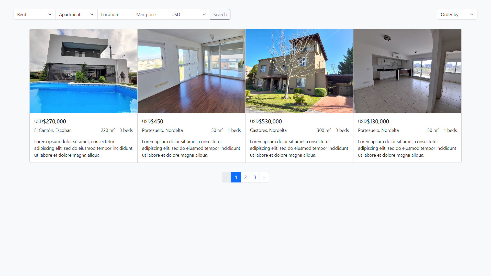
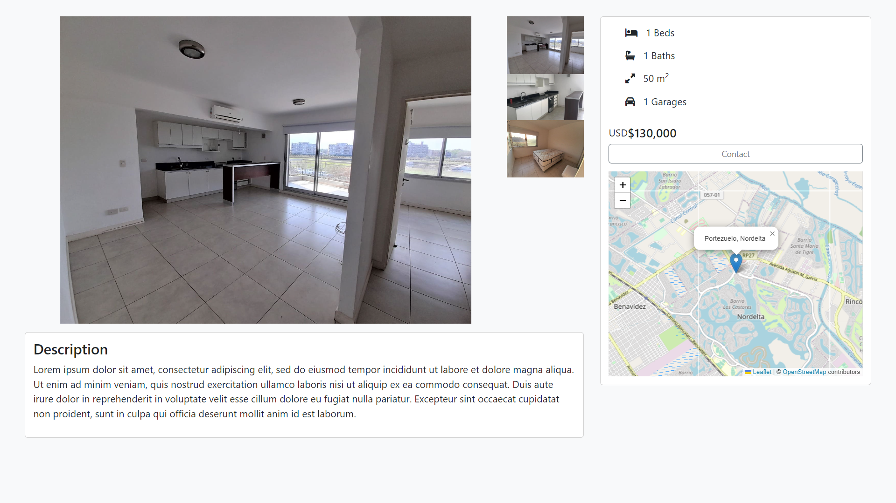

# CS50's Harvard Final Project
## Real Estate Web

Python, SQL, JavaScript, HTML, CSS, Flask.

[Go to the web](http://kepler296e.pythonanywhere.com/)

#### Description:
The purpose of this project is to provide an easy-to-use platform to view properties (houses, apartments, etc.) available for sale or rent (or any other operation loaded to the db) and contact the real estate agents. Users can apply various filters such as property type, location, max price, currency, as well as perform text searches and sort properties by ascending or descending prices. Also, the properties have a map that can be zoomed in and out. The website is responsive and can be used on mobile devices.

#### File Structure:
- **static/**:
    - **images/**: Property images.
    - **styles.css**: CSS styles.
- **templates/**:
    - **index.html**: Home page.
    - **layout.html**: Base template.
    - **property.html**: Property details.
- **flask_app.py**: Main Flask app.
- **populate_db.py**: Databse population.
- **real_estate.db**: MySQL database.

#### Database Schema:
- **operation**
- **type**
- **location**
- **sublocation**
- **currency**
- **agent**
- **property**
